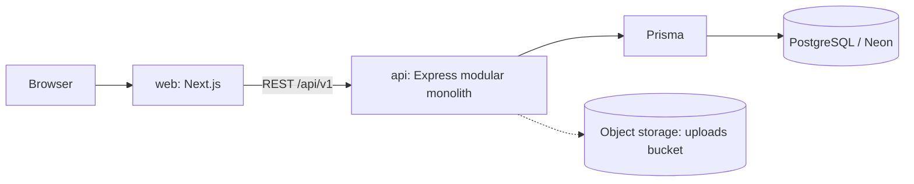
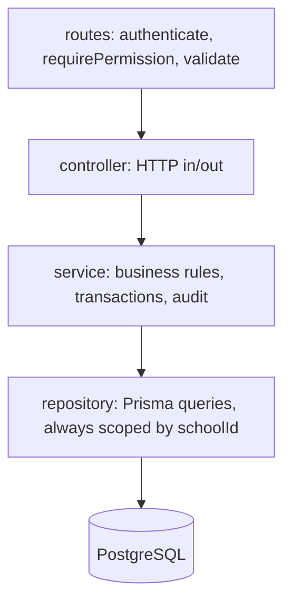

# CampusOne architecture (V1: simple modular monolith)

## System overview



No Nginx, Redis, queues or microservices in V1. Add them when real usage requires it.

## API layers (per module)



Cross-cutting: request id + logging, helmet, CORS, rate limiting, one error handler that
returns `{ "error": { "code", "message", "details", "requestId" } }`.

## Folder layout

```
api/
  prisma/            schema.prisma, migrations/, seed.ts
  src/
    config/env.ts    validated environment (fails fast)
    lib/             prisma, logger, errors, permissions catalog
    middleware/      auth, validate, error-handler, request-context, not-found
    modules/<name>/  <name>.routes | controller | service | repository | schemas
    routes.ts        registers every module under /api/v1
  tests/
web/
  src/app/           Next.js routes: (auth)/login, (portal)/student|parent|teacher|principal|admin|developer
  src/components/    shared UI (DataTable, Form, Modal, ...)
  src/features/<name>/  UI + hooks for one module
  src/lib/api.ts     the only place that calls the API
```

## Adding a module (checklist)
1. Add models to `schema.prisma` and create a migration.
2. Add permission keys to `api/src/lib/permissions.ts` (seed picks them up).
3. Copy `modules/academic-years` as a template: schemas -> repository -> service -> controller -> routes.
4. Register the router in `api/src/routes.ts`.
5. Write service unit tests and at least one permission/isolation test.
6. Build the UI in `web/src/features/<name>`.

## Security defaults already in place
Validated env, helmet, CORS allow-list, rate limiting, body size limit, request ids, secrets
redacted from logs, permission-checked routes, generic 500 errors. Still to build in Phase 2:
login, password hashing policy, sessions/tokens, password reset, account lockout, audit writes.

## Roadmap alignment
Phase 1 (this scaffold): foundation + masters. Next: auth + RBAC (Phase 2), school and academic
masters CRUD, students/parents/teachers, enrollment, timetable, attendance, leave, substitution,
exams, assignments, fees, dashboards, reports, hardening, deployment.
